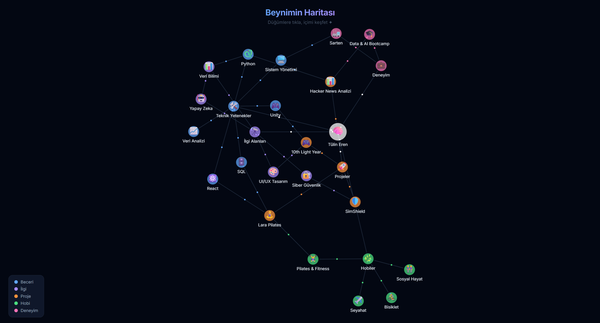

# Beyin Haritası

> İnteraktif zihin haritası oluşturma ve görselleştirme aracı

---

## Proje Hakkında

Kendimi ve düşünce dünyamı tanıtmak için farklı bir yol aradım. Beyin Haritası, becerilerimi, ilgi alanlarımı, projelerimi ve hobilerimi statik bir CV yerine interaktif ve görsel bir grafik üzerinde sunuyor. React ve fizik tabanlı bir graf motoru kullanarak her düğümün birbirine organik şekilde bağlandığı, keşfedilebilir bir portfolyo deneyimi oluşturdum.

---

## Özellikler

- **İnteraktif Harita** — Sürükle-bırak ile düğümleri özgürce konumlandır
- **Düğüm Ekleme** — Yeni fikir ve kavramları kolayca ekle
- **Bağlantı Kurma** — Düğümler arasında ilişki bağlantıları oluştur
- **Görsel Tasarım** — Temiz ve sezgisel arayüz
- **Hızlı & Hafif** — Vite ile optimize edilmiş performans

---

## Teknoloji Stack

| Teknoloji | Açıklama |
|-----------|----------|
| React 18 | Kullanıcı arayüzü |
| Vite | Build aracı |
| react-force-graph-2d | Graf görselleştirme |
| D3 Force | Fizik tabanlı düğüm yerleşimi |
| gh-pages | GitHub Pages deploy |

---

## Kurulum

### Gereksinimler

- Node.js 18+
- npm